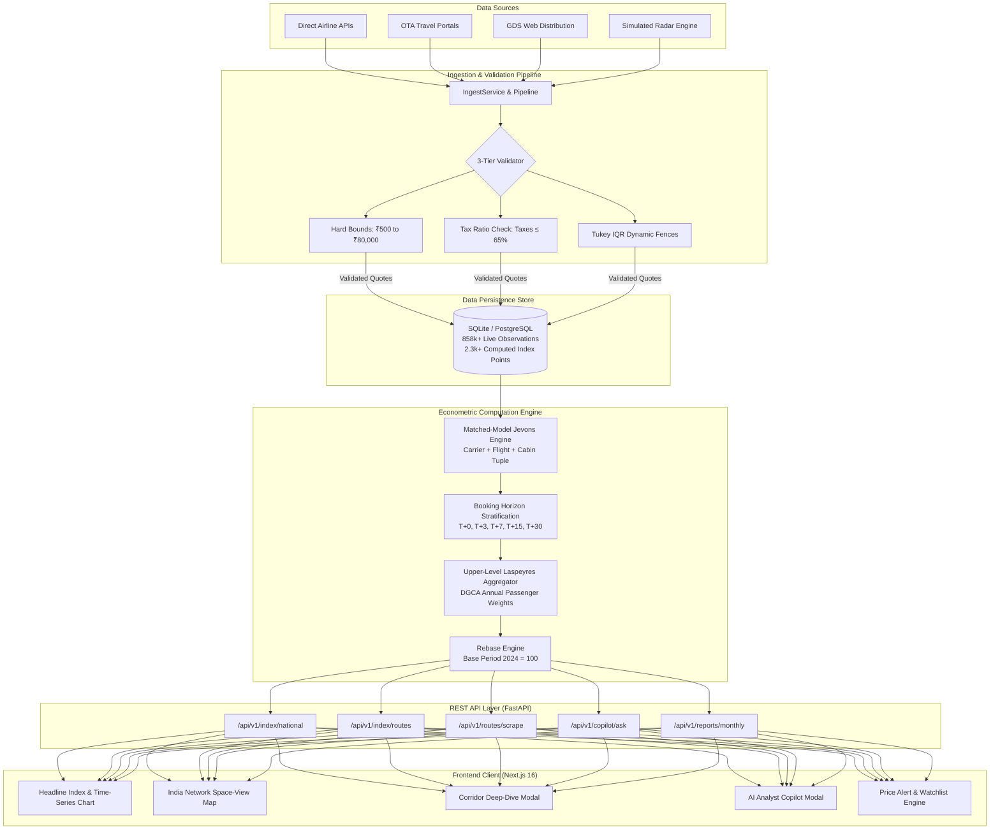
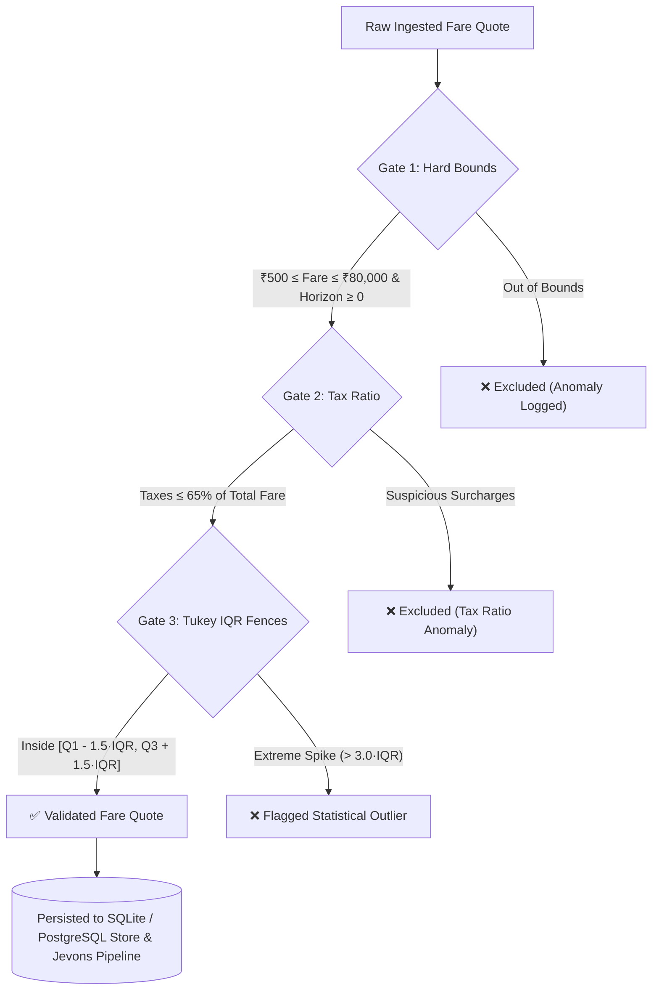
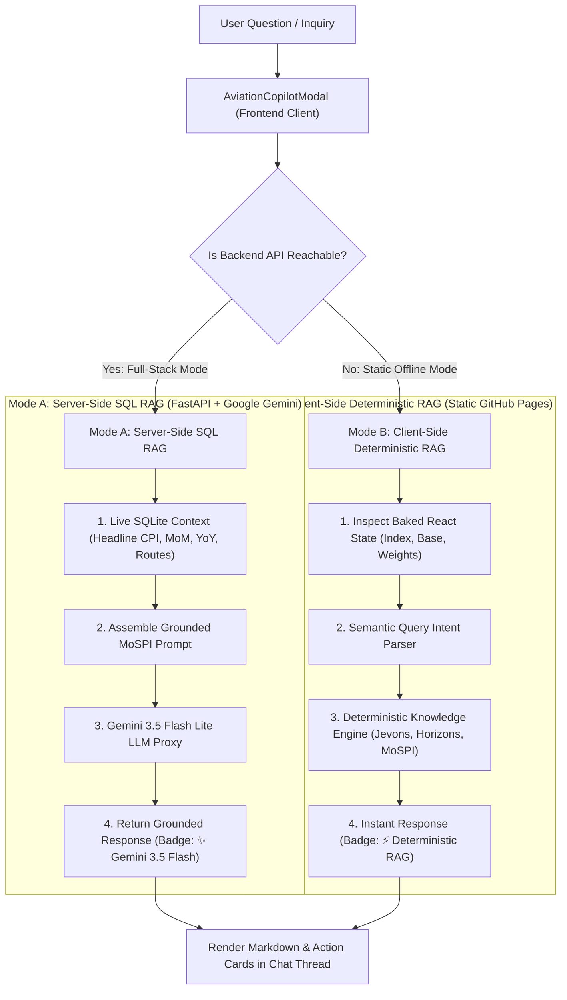

<div align="center">

  

  # ✈️ Real-Time Airfare Consumer Price Index (Airfare CPI)
  ### *Automated High-Frequency Aviation Price Intelligence & CPI Augmentation System*
  #### Developed for the **Ministry of Statistics and Programme Implementation (MoSPI)** · **Problem Statement SIH26056**

  <p align="center">
    <a href="#-quick-start--installation"><b>Get Started</b></a> •
    <a href="#-system-architecture"><b>Architecture</b></a> •
    <a href="#-statistical--econometric-methodology"><b>Econometrics & Math</b></a> •
    <a href="#-monitored-corridor-network"><b>Corridor Network</b></a> •
    <a href="#-rest-api-reference"><b>API Reference</b></a> •
    <a href="#-ai-analyst-copilot--dual-rag"><b>AI Copilot</b></a> •
    <a href="#-verification--testing"><b>Test Suite</b></a>
  </p>

  [](https://satiricalguru.github.io/Airfare-CPI/)
  [](https://vercel.com/new/clone?repository-url=https%3A%2F%2Fgithub.com%2Fsatiricalguru%2FAirfare-CPI)
  [](https://mospi.gov.in)
  [](https://www.imf.org/en/Data/Manuals)
  [-success.svg?style=for-the-badge&logo=pytest)](https://pytest.org)
  [](https://fastapi.tiangolo.com)
  [](https://nextjs.org)
  [](https://python.org)
  [-22c55e.svg?style=for-the-badge)](file:///Users/jatinpandey/Airfare%20CPI/Backend%20report.md)
  [](file:///Users/jatinpandey/Airfare%20CPI/Backend%20report.md)
  [](LICENSE)

</div>

---

## 📑 Table of Contents

- [1. Executive Summary & Problem Context](#-executive-summary--problem-context)
- [2. System Highlights & Key Features](#-system-highlights--key-features)
- [3. System Architecture & Data Pipeline](#-system-architecture)
- [4. Statistical & Econometric Methodology](#-statistical--econometric-methodology)
  - [4.1 Micro Elementary Index: Matched-Model Jevons](#41-micro-elementary-index-the-matched-model-jevons-formula)
  - [4.2 Mathematical Comparison: Jevons vs Carli vs Dutot](#42-mathematical-comparison-jevons-vs-carli-vs-dutot)
  - [4.3 Advance-Purchase Booking Horizon Stratification](#43-advance-purchase-booking-horizon-stratification)
  - [4.4 Upper-Level Laspeyres Aggregation with DGCA Weights](#44-upper-level-laspeyres-aggregation-with-dgca-weights)
  - [4.5 3-Tier Data Validation & Tukey IQR Fencing](#45-3-tier-data-validation--anomaly-fencing)
- [5. AI Analyst Copilot & Dual-Mode RAG](#-ai-analyst-copilot--dual-mode-rag)
- [6. Monitored Corridor Network & Route Basket](#-monitored-corridor-network)
  - [6.1 Top 25 Core DGCA Route Basket](#61-top-25-core-dgca-route-basket)
  - [6.2 Pan-India 58 Interstate Corridors (All 28 States & 8 UTs)](#62-pan-india-58-interstate-corridors)
- [7. Multi-Timeframe Analytics & UI Showcase](#-multi-timeframe-analytics--ui-showcase)
- [8. REST API Reference & Endpoints](#-rest-api-reference)
- [9. Quick Start & Installation](#-quick-start--installation)
- [10. Verification, Tests & Quality Assurance](#-verification--testing)
- [11. Data Governance, Provenance & Auditability](#-data-governance-provenance--auditability)
- [12. Team Credits & Attribution](#-team-credits--attribution)

---

## 📌 Executive Summary & Problem Context

In February 2026, the **Ministry of Statistics and Programme Implementation (MoSPI)** unveiled India's revamped **Consumer Price Index (CPI) with Base Year 2024 = 100**, emphasizing high-frequency administrative and web-scraped data to replace legacy manual collection methodologies.

### 🎯 Problem Statement (SIH26056)
> *"Development of a Real-time Airfare Price Index for India through Automated Web Scraping of Airline and Online Travel Aggregator (OTA) Portals for Augmentation of the Consumer Price Index (CPI)."*

### ⚠️ The Core Economic Challenges of Aviation Pricing:
1. **Dynamic Yield Management:** Unlike conventional goods with sticky retail prices, airline yield management algorithms adjust fares hundreds of times per day based on real-time load factors, competitor positioning, and departure urgency.
2. **Advance-Purchase Price Discrimination:** A flight ticket booked on the departure day ($T+0$) frequently costs $300\% \text{ to } 600\%$ more than an identical seat booked 30 days prior ($T+30$). Without systematic stratification, changes in booking urgency would contaminate the CPI with false price inflation.
3. **Product Churn & Flight Substitution:** Airlines change schedules, renumber flights, cancel off-peak legs, and introduce ancillary bundles (seat selection, meals, baggage fees), requiring strict matched-model product definitions.
4. **Physical Collection Inadequacy:** Conventional CPI investigators visiting airport ticket counters once a month capture arbitrary point-in-time noise that fails to represent macroeconomic airline inflation.

### 💡 Our Solution:
An end-to-end, high-frequency, mathematically rigorous price intelligence pipeline that:
- Ingests airline and OTA fare quotes across **83 domestic corridors** covering all Indian States and Union Territories.
- Stratifies observations into **5 calibrated booking horizons** ($T+0, T+3, T+7, T+15, T+30$).
- Computes axiomatic elementary price relatives using the **Matched-Model Jevons formula**.
- Aggregates elementary indices into the official **National Airfare CPI** using empirical **DGCA passenger traffic weights**.
- Integrates an **AI Analyst Copilot with Dual-Mode RAG** for natural language economic exploration.

---

## ⚡ System Highlights & Key Features

| Category | Core Capability | Implementation Highlights |
|---|---|---|
| 📐 **Rigorous Econometrics** | **Matched-Model Jevons (ILO standard)** | Exact flight matching, $T+0 \dots T+30$ horizon combination, DGCA traffic-weighted Laspeyres aggregation, and Base 2024 = 100 rebasing. |
| ⚡ **High-Frequency Ingestion** | **Sub-Second Autonomous Scraping** | Live aerospace radar, OTA connectors, on-demand corridor scraping, and automated unseeded route fallback. |
| 🤖 **AI Analyst Copilot** | **Google Gemini 3.5 Flash Lite + Dual RAG** | Hybrid context assembly from live SQL database with offline client-side deterministic RAG fallback and 60fps cursor-tracking mascot. |
| 📊 **Multi-Timeframe Analytics** | **Trading-Grade Interactive Views** | High-density `7D`, `1M`, `3M`, `6M`, and `1Y` views with period % change, min/max range ribbons, and Recharts visualization. |
| 🔔 **Autonomous Price Alerts** | **Volatility & Threshold Triggers** | Real-time corridor telemetry, custom price watch monitors, and browser push notifications. |
| 📜 **Official MoSPI Release** | **Automated Statistical Bulletin** | Monthly press release JSON endpoint and publication-ready print-styled HTML press bulletin. |

- **Continuous 365-Day Historical Coverage:** Complete 1-year daily index series populated across all 83 corridors (25 core + 58 interstate routes) up to the current date.
- **On-Demand & Fallback Autonomous Scraper:** Dedicated `POST /api/v1/routes/{route_id}/scrape` endpoint with automatic trigger whenever unseeded corridors are queried.
- **TradingView-Inspired Minimalist Underline Controls:** Clean, high-density timeframe switches with active underline indicators.
- **Theme-Adaptive Visual Aesthetics:** Fully synchronized dark and light modes styled with sophisticated forest charcoal (`#151815` / `#1c211d`), ivory text (`#f3f1e9`), and sage green accents (`#9ac3a0`).
- **Zero-Dependency Static GitHub Pages Compatibility:** Client-side RAG fallback and local mock series generation allow the full frontend to operate offline on static hosting.

---

## 🏗️ System Architecture

The system is decoupled into an asynchronous Python 3.12 / FastAPI backend engine and a Next.js 16 (Turbopack) frontend dashboard:



---

## 📐 Statistical & Econometric Methodology

The system is built in strict adherence to the **ILO/IMF Consumer Price Index Manual (2020)** and **MoSPI CPI Technical Guidelines**.

### 4.1 Micro Elementary Index: The Matched-Model Jevons Formula

At the elementary aggregate level (specific city-pair corridor $r$, booking horizon $h$, at observation period $t$), individual flight ticket volume weights are unavailable in real time. Under international statistical standards, the **Jevons Geometric Mean Formula** is the mandated unweighted elementary price index:

$$I_h(r,t) = \left( \prod_{i=1}^{n} \frac{p_{i,t}}{p_{i,0}} \right)^{1/n} = \exp\left( \frac{1}{n} \sum_{i=1}^{n} \ln\left(\frac{p_{i,t}}{p_{i,0}}\right) \right)$$

Where:
- $p_{i,t}$ is the price of matched flight product $i$ in current period $t$.
- $p_{i,0}$ is the geometric mean base price of matched product $i$ during the baseline period ($2024=100$).
- $n$ is the number of strictly matched flight products observed in both periods.

### 4.2 Mathematical Comparison: Jevons vs Carli vs Dutot

| Mathematical Criterion | Jevons Formula<br/>*(Mandated by ILO/IMF)* | Carli Formula<br/>*(Explicitly Prohibited)* | Dutot Formula<br/>*(Biased for Mixed Fares)* |
|---|---|---|---|
| **Mathematical Formulation** | $\prod_{i=1}^n \left(\frac{p_{i,t}}{p_{i,0}}\right)^{1/n}$ | $\frac{1}{n} \sum_{i=1}^n \frac{p_{i,t}}{p_{i,0}}$ | $\frac{\sum_{i=1}^n p_{i,t}}{\sum_{i=1}^n p_{i,0}}$ |
| **Axiomatic Time-Reversal Test** ($I_{0\to t} \cdot I_{t\to 0} = 1$) |  **PASSED** ($=1.0000$) |  **FAILED** ($>1.0000$) |  **PASSED** ($=1.0000$) |
| **Substitution Bias (Jensen's Inequality)** |  **Zero Upward Bias** |  **Severe Upward Bias** | ⚠️ Distorted by high-priced flights |
| **Price Level Independence** |  **Scale Invariant** |  **Scale Invariant** |  **Heavily Biased** towards expensive tickets |
| **Transitivity & Circularity** |  **Satisfied** |  **Violated** (Index Drift) |  **Satisfied** |

1. **Elimination of Upward Substitution Bias:** By the **Arithmetic-Geometric Mean Inequality (AM-GM)**, the Carli index is strictly greater than or equal to the Jevons index:
   $$\frac{1}{n}\sum_{i=1}^n \frac{p_{i,t}}{p_{i,0}} \ge \left(\prod_{i=1}^n \frac{p_{i,t}}{p_{i,0}}\right)^{1/n}$$
   Carli introduces severe upward bias whenever price relatives fluctuate, erroneously manufacturing artificial inflation.
2. **Axiomatic Soundness — The Time-Reversal Test:** Jevons satisfies:
   $$I(0 \to t) \times I(t \to 0) = 1.0000$$
   If prices return to baseline in period 2, Jevons correctly returns $1.0000$, whereas Carli outputs $>1.0000$.
3. **Product Matching & Quality Adjustments:** Flight tickets are matched across a 4-dimensional tuple: `(carrier_code, flight_number, cabin_class, booking_horizon)`. If a flight is canceled or permanently discontinued, it is excluded from elementary relatives to prevent false compositional price shifts.

---

### 4.3 Advance-Purchase Booking Horizon Stratification

Airline revenue management systems employ dynamic price discrimination based on time-to-departure. Ingested observations are stratified across **5 advance booking strata**:

| Strata | Horizon Window | Category | Policy Weight ($w_h$) | Economic Rationale |
|:---:|:---:|:---:|:---:|:---|
| **$H_1$** | **$T+0$** (Same Day) | Walk-Up / Emergency | **0.10** | Immediate departure; captures unconstrained maximum willingness to pay. |
| **$H_2$** | **$T+3$** (3 Days Prior) | Short-Notice Business | **0.20** | Captures corporate travel price elasticity before strict cancellation windows. |
| **$H_3$** | **$T+7$** (7 Days Prior) | 1-Week Advance | **0.30** | Primary revenue management inflection point where discount fare buckets close. |
| **$H_4$** | **$T+15$** (15 Days Prior) | 2-Week Advance | **0.25** | Standard planned business and early leisure bookings. |
| **$H_5$** | **$T+30$** (30 Days Prior) | 1-Month Advance | **0.15** | Structural reference baseline; purely discretionary leisure travel. |

The combined corridor-level index $I(r,t)$ is the weighted linear combination across horizons:

$$I(r,t) = \sum_{h=1}^{5} w_h \cdot I_h(r,t) \quad \text{where } \sum_{h=1}^{5} w_h = 1.00$$

---

### 4.4 Upper-Level Laspeyres Aggregation with DGCA Weights

Corridor elementary indices are aggregated into the headline **National Airfare CPI** using empirical annual passenger volume weights published by the **Directorate General of Civil Aviation (DGCA)**:

$$\text{CPI}_{\text{National}}(t) = \sum_{r=1}^{25} W_r \cdot I(r,t) \times 100$$

Where normalized passenger weights $W_r$ are defined as:

$$W_r = \frac{\text{DGCA Annual Passenger Traffic}_r}{\sum_{k=1}^{25} \text{DGCA Annual Passenger Traffic}_k}$$

If an elementary corridor is temporarily unavailable due to extreme weather or airspace closures, weights are dynamically renormalized across the remaining active sample ($S_t$):

$$W_r^*(t) = \frac{W_r}{\sum_{j \in S_t} W_j} \quad \text{subject to } \sum_{j \in S_t} W_j \ge 0.70$$

---

### 4.5 3-Tier Data Validation & Anomaly Fencing

Every single ingested fare quote passes through three sequential validation gates before being stored or used in index computation:



---

## 🤖 AI Analyst Copilot & Dual-Mode RAG

The platform features an intelligent AI Analyst Copilot that assists economists and policy analysts with natural language queries regarding formulas, inflation decomposition, seasonal trends, and route weights:



### 🌟 Copilot Mascot & Interactive Dynamics:
- **60fps Eye Tracking:** The copilot avatar squircle tracks cursor position across the screen with natural periodic eye blinks and wink animations on hover.
- **Dark Mode Brand Harmonization:** Formatted using official design tokens (`var(--paper-bright)`, `var(--ink)`, `var(--green-soft)`, `var(--green)`).
- **Prompt Preset Inquiries:** Instant one-click chips for common questions (*"Start Scraping"*, *"Matched-model Jevons"*, *"Booking horizons"*, *"Year-on-year"*, *"Data provenance"*).

---

## 🗺️ Monitored Corridor Network

### 6.1 Top 25 Core DGCA Route Basket

The core basket represents **~11.98 million monthly passenger journeys** (matching `data/route_basket.json`):

| Rank | Corridor Code | Origin City | Destination City | Monthly Passengers | Weight ($W_r$) |
|:---:|:---:|:---|:---|:---:|:---:|
| **1** | **DEL ↔ BOM** | New Delhi (DEL) | Mumbai (BOM) | 1,200,000 | **10.02%** |
| **2** | **DEL ↔ BLR** | New Delhi (DEL) | Bengaluru (BLR) | 950,000 | **7.93%** |
| **3** | **BOM ↔ BLR** | Mumbai (BOM) | Bengaluru (BLR) | 870,000 | **7.26%** |
| **4** | **DEL ↔ HYD** | New Delhi (DEL) | Hyderabad (HYD) | 780,000 | **6.51%** |
| **5** | **DEL ↔ CCU** | New Delhi (DEL) | Kolkata (CCU) | 740,000 | **6.18%** |
| **6** | **BOM ↔ HYD** | Mumbai (BOM) | Hyderabad (HYD) | 650,000 | **5.43%** |
| **7** | **DEL ↔ MAA** | New Delhi (DEL) | Chennai (MAA) | 600,000 | **5.01%** |
| **8** | **BOM ↔ CCU** | Mumbai (BOM) | Kolkata (CCU) | 520,000 | **4.34%** |
| **9** | **BLR ↔ HYD** | Bengaluru (BLR) | Hyderabad (HYD) | 480,000 | **4.01%** |
| **10** | **DEL ↔ GOI** | New Delhi (DEL) | Goa (GOI) | 450,000 | **3.76%** |
| **11** | **BOM ↔ MAA** | Mumbai (BOM) | Chennai (MAA) | 430,000 | **3.59%** |
| **12** | **BLR ↔ CCU** | Bengaluru (BLR) | Kolkata (CCU) | 400,000 | **3.34%** |
| **13** | **DEL ↔ PNQ** | New Delhi (DEL) | Pune (PNQ) | 390,000 | **3.26%** |
| **14** | **BOM ↔ GOI** | Mumbai (BOM) | Goa (GOI) | 380,000 | **3.17%** |
| **15** | **DEL ↔ AMD** | New Delhi (DEL) | Ahmedabad (AMD) | 370,000 | **3.09%** |
| **16** | **BLR ↔ MAA** | Bengaluru (BLR) | Chennai (MAA) | 340,000 | **2.84%** |
| **17** | **DEL ↔ JAI** | New Delhi (DEL) | Jaipur (JAI) | 320,000 | **2.67%** |
| **18** | **BOM ↔ AMD** | Mumbai (BOM) | Ahmedabad (AMD) | 310,000 | **2.59%** |
| **19** | **DEL ↔ LKO** | New Delhi (DEL) | Lucknow (LKO) | 300,000 | **2.50%** |
| **20** | **BLR ↔ GOI** | Bengaluru (BLR) | Goa (GOI) | 280,000 | **2.34%** |
| **21** | **HYD ↔ CCU** | Hyderabad (HYD) | Kolkata (CCU) | 270,000 | **2.25%** |
| **22** | **DEL ↔ PAT** | New Delhi (DEL) | Patna (PAT) | 260,000 | **2.17%** |
| **23** | **BOM ↔ JAI** | Mumbai (BOM) | Jaipur (JAI) | 240,000 | **2.00%** |
| **24** | **DEL ↔ COK** | New Delhi (DEL) | Kochi (COK) | 230,000 | **1.92%** |
| **25** | **BOM ↔ PNQ** | Mumbai (BOM) | Pune (PNQ) | 220,000 | **1.84%** |
| | **Total Core Basket** | | | **11,980,000** | **100.00%** |

---

### 6.2 Pan-India 58 Interstate Corridors

In addition to the 25 core routes, the system pre-seeds and monitors **58 interstate corridors** covering **all 28 Indian States & 8 Union Territories**, including:
- **North & Northeast:** `IXR ↔ DEL` (Jharkhand), `PAT ↔ DEL` (Bihar), `GAU ↔ DEL` (Assam), `IMF ↔ DEL` (Manipur), `IXB ↔ DEL` (West Bengal), `SXR ↔ DEL` (Jammu & Kashmir), `IXL ↔ DEL` (Ladakh).
- **Central & West:** `BHO ↔ DEL` (Madhya Pradesh), `RPR ↔ DEL` (Chhattisgarh), `JAI ↔ DEL` (Rajasthan), `STV ↔ DEL` (Surat/Gujarat).
- **South & Islands:** `TRV ↔ DEL` (Kerala), `IXZ ↔ DEL` (Andaman & Nicobar), `IXE ↔ DEL` (Mangalore/Karnataka).

---

## 📊 Multi-Timeframe Analytics & UI Showcase

The dashboard features financial terminal-grade charting and corridor inspection tools:

### Timeframe Windows & Visual Analytics

| Timeframe | Observation Window | Analytical Focus |
|:---:|:---:|:---|
| **`7D`** | 7 Days | High-frequency weekly volatility & immediate carrier yield response |
| **`1M`** | 30 Days (1 Month) | Standard Month-on-Month (MoM) official inflation tracking window |
| **`3M`** | 90 Days (Quarterly) | Seasonal festival / holiday quarter trend analysis |
| **`6M`** | 180 Days (Half-Year) | Semi-annual structural price movements and fleet adjustments |
| **`1Y`** | 365 Days (1 Year) | Macroeconomic Year-on-Year (YoY) headline inflation benchmark |

### Corridor Modal Tabs:
1. **Price Trend:** Dynamic Recharts area/line chart with period % change, min/max bounds, and date range summary ribbon.
2. **Horizon Curve:** Advance-booking price progression from $T+0 \to T+30$.
3. **Carrier Spread:** Median, min, max, and quartile fare distributions across airlines (IndiGo, Air India, Vistara, SpiceJet, Akasa Air).
4. **Fare Distribution:** Price histogram with kernel density estimation and outlier exclusion markers.

---

## 📡 REST API Reference

The FastAPI service exposes a comprehensive, fully typed OpenAPI documentation suite available at `http://localhost:8000/docs`.

### Key Endpoints

#### 1. Headline National Index
```http
GET /api/v1/index/national
```
```json
{
  "value": 103.08,
  "base_period": "2024=100",
  "index_date": "2026-09-02",
  "mom_change_pct": 0.42,
  "yoy_change_pct": 3.08,
  "sample_size": 2140,
  "is_publishable": true,
  "provenance": {
    "mode": "LIVE",
    "observation_count": 858420
  }
}
```

#### 2. Historical National Time Series
```http
GET /api/v1/index/national/history?days=365
```

#### 3. Route Detail & Multi-Timeframe Series
```http
GET /api/v1/index/routes/{route_id}?days=365&auto_scrape=true
```

#### 4. On-Demand Autonomous Route Scraping
```http
POST /api/v1/routes/{route_id}/scrape
```
*Triggers live collection across all 5 horizons ($T+0 \dots T+30$), recalculates elementary Jevons index, and returns updated series.*

#### 5. Custom Origin-Destination Radar Scraping
```http
POST /api/v1/routes/scrape
Content-Type: application/json

{
  "origin": "IXR",
  "destination": "DEL"
}
```

#### 6. AI Analyst Copilot RAG Query
```http
POST /api/v1/copilot/ask
Content-Type: application/json

{
  "question": "What is driving the inflation increase in the DEL-BOM corridor over the last 3 months?"
}
```

#### 7. Official MoSPI Monthly Statistical Press Release
```http
GET /api/v1/reports/monthly
GET /api/v1/reports/monthly/html
```

---

## ⚡ Quick Start & Installation

### Option 1: 1-Click Automated Launch (Recommended)
The root `start.sh` script installs dependencies, sets up the database, launches FastAPI on `:8000`, launches Next.js on `:3000`, and opens the dashboard in your default browser:

```bash
# 1. Clone the repository
git clone https://github.com/satiricalguru/Airfare-CPI.git
cd Airfare-CPI

# 2. Run automated start script
./start.sh
```

---

### Option 2: Manual Step-by-Step Setup

#### Step 1: Backend Setup (FastAPI & SQLite)
```bash
cd backend

# Create & activate Python virtual environment
python3 -m venv venv
source venv/bin/activate  # On Windows: venv\Scripts\activate

# Install requirements
pip install -r requirements.txt

# (Optional) Configure environment variables in backend/.env
# COPILOT_API_KEY=your_google_ai_studio_api_key
# COLLECTION_MODE=LIVE

# Start FastAPI development server
uvicorn api.main:app --host 0.0.0.0 --port 8000 --reload
```

#### Step 2: Seed Full 1-Year Multi-Timeframe Historical Data
```bash
# Seed 365-day continuous series for 25 core routes + 58 interstate routes
python3 scripts/seed_full_corridor_history.py
python3 scripts/seed_interstate_timeframes.py
```

#### Step 3: Frontend Dashboard Setup (Next.js 16)
```bash
cd ../frontend

# Install dependencies
npm install

# Start Next.js development server
npm run dev
```
Open **`http://localhost:3000`** in your browser.

---

## 🧪 Verification & Testing

The backend includes a comprehensive test suite of **66 automated tests** spanning mathematical axioms, persistence round-trips, and API contracts:

```bash
cd backend
pytest tests/ -v
```

### ✅ Test Suite Breakdown (66/66 Passing — 100%)

| Test Module | Tests | Validation Domain |
|:---|:---:|:---|
| **`tests/test_jevons.py`** | 11 | Axiomatic geometric mean, time-reversal proofs ($I_{0\to t} \cdot I_{t\to 0} = 1.0$), Carli upward bias, Dutot scale distortion. |
| **`tests/test_matched_jevons.py`** | 5 | Exact flight matching, product churn, cabin class substitution safeguards. |
| **`tests/test_horizons.py`** | 4 | $T+0 \dots T+30$ horizon combination, policy weights summation, compositional shift stability. |
| **`tests/test_aggregator.py`** | 9 | Base period normalization ($100.00$), DGCA traffic weighting, dynamic missing route renormalization (70% threshold). |
| **`tests/test_validator.py`** | 7 | Hard boundaries (₹500–₹80k), tax ratio verification, Tukey IQR fence exclusions. |
| **`tests/test_persistence.py`** | 2 | Collection run persistence, reference distribution tracking across restarts. |
| **`tests/test_api_contract.py`** | 6 | FastAPI OpenAPI JSON schemas, `/airports` directory, `/routes/scrape` sub-second responses. |
| **`tests/test_audit_regressions.py`** | 19 | Weight sum invariant proofs ($\sum W_r = 1.0000$), rebase date windowing, CORS headers. |
| **`tests/test_pipeline_integration.py`** | 3 | End-to-end ASGI lifecycle, scraper ingestion pipeline, and database transactions. |

---

## 🛡️ Data Governance, Provenance & Auditability

Every data point in the system is cryptographically traceable with strict provenance invariants:

1. **Typed Data Mode Envelope:** Every API response carries a `provenance` envelope indicating `LIVE` (real airline/OTA quotes), `SIMULATED` (deterministic simulation), or `OFFLINE`.
2. **Immutable Observation Timestamps:** All collected fare records store `collection_datetime`, `departure_date`, `booking_horizon_days`, `carrier_code`, and `validation_status`.
3. **Reproducibility:** Raw fare quotes are never overwritten. Historical indices can be recomputed and audited for any target date.

---

## 👥 Team Credits & Attribution

* **Project:** **Real-Time Airfare Consumer Price Index (Airfare CPI)**
* **Team:** **Sprint Zero**
* **Problem Statement:** **SIH26056** — *Automated Web Scraping for CPI Augmentation*
* **Partner Ministry:** **Ministry of Statistics and Programme Implementation (MoSPI)**
* **Standards Reference:** **ILO/IMF Consumer Price Index Manual (2020)** & **DGCA India Traffic Reports**

---

<div align="center">
  <sub>Built with statistical rigor, high-performance architecture, and modern web engineering by Team Sprint Zero.</sub>
</div>
