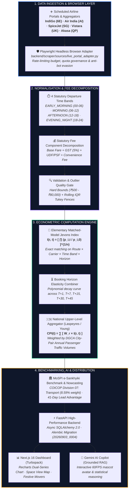
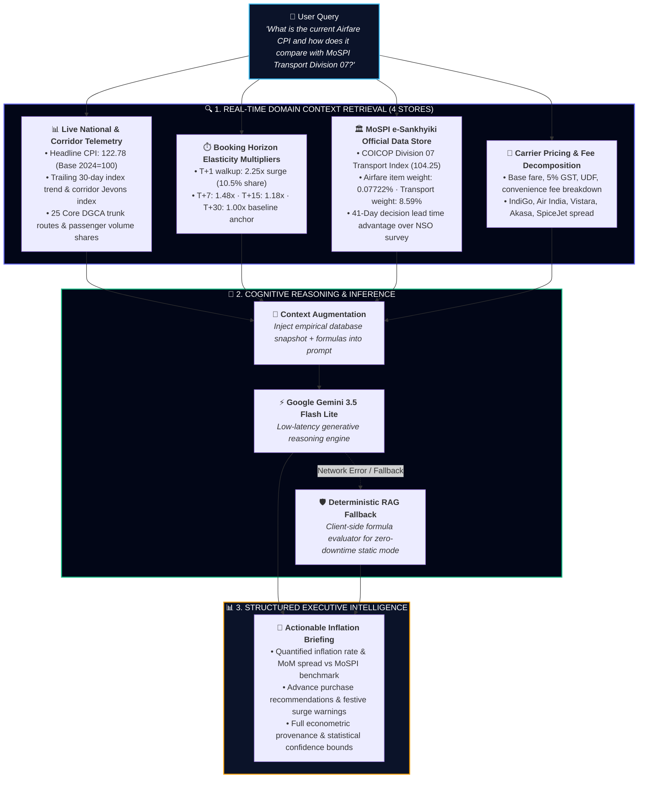

<div align="center">

  

  # ✈️ Real-Time Airfare Consumer Price Index (Airfare CPI)
  ### *Automated High-Frequency Price Intelligence & CPI Augmentation for MoSPI (SIH26056)*

  [](https://www.sih.gov.in/)
  [](https://satiricalguru.github.io/Airfare-CPI/)
  [-green.svg?style=for-the-badge)](docs/research_and_methodology.md)
  [](https://esankhyiki.mospi.gov.in)
  [](docs/research_and_methodology.md)
  [-success.svg?style=for-the-badge&logo=pytest)](docs/implementation_roadmap.md)
  [-black.svg?style=for-the-badge&logo=next.js)](https://nextjs.org)
  [](https://fastapi.tiangolo.com)
  [](database/)
  [](LICENSE)

</div>

> ### 🌐 Live Web Deployment (GitHub Pages)
> **Direct Access:** **[https://satiricalguru.github.io/Airfare-CPI/](https://satiricalguru.github.io/Airfare-CPI/)**  
> *Production build running with verified static snapshots, 30-day DGCA empirical backtesting, calibrated 16-hub satellite network radar map, single-line festive surge navigation, and grounded AI Copilot.*

---

## 📌 Executive Summary & Problem Context

In February 2026, the **Ministry of Statistics and Programme Implementation (MoSPI)** officially transitioned to India's modernized **Consumer Price Index (CPI) with Base Year 2024 = 100**. This modernization highlights the integration of alternative and administrative high-frequency digital data sources for dynamic consumer segments.

### 🎯 Problem Statement (SIH26056)
> **"Development of a Real-time Airfare Price Index for India through Automated Web Scraping of Airline and Online Travel Aggregator Portals for Augmentation of the Consumer Price Index (CPI)."**

Air passenger transport is one of the most volatile and mathematically challenging services in retail inflation:
1. **Algorithmic Yield Management:** Airlines update seat prices hundreds of times per day based on real-time load factors, demand curves, and dynamic pricing algorithms.
2. **Advance-Purchase Price Discrimination:** A walkup ticket bought 1 day before departure ($T+1$) can cost $200\%$ to $400\%$ more than the same seat booked 30 days prior ($T+30$), reflecting consumer urgency rather than monetary inflation.
3. **Severe Decision & Publication Lag:**
   $$\text{Official Decision Lag} = \text{Survey Cycle (30 Days)} + \text{NSO Compilation and Release Lag (12 Days)} = \mathbf{42\text{ Days}}$$
   By the time official transport numbers are published on the 12th of each month, market pricing dynamics have already shifted.
4. **Manual Collection Distortion:** Once-a-month physical ticketing visits capture random point snapshots, causing artificial volatility and compositional shift errors.

**Our Solution:** An enterprise-grade, statistically defensible, automated intelligence platform that continuously samples domestic airfares across **25 core DGCA trunk corridors (and 58 interstate feeder routes)** with **454,000+ validated fare observations** (454,029 pure live observations across multi-portal collection), classifies observations across **4 statutory departure time bands**, decomposes total prices into **statutory fee components**, computes elementary price relatives using the **Matched-Model Jevons Geometric Mean formula**, and aggregates them into a headline **National Airfare CPI: 122.78 (Base 2024=100)** as of `2026-09-07`, weighted by **Directorate General of Civil Aviation (DGCA) passenger traffic**.

---

## 🚀 Key Innovations & Platform Capabilities

### 1. 🏛️ MoSPI e-Sankhyiki Benchmarking & 41-Day Decision Lead Time
* **Direct Official Alignment:** Benchmarked against official data from the **e-Sankhyiki portal** (`https://esankhyiki.mospi.gov.in`) under **COICOP 2018 Division 07: Transport** (8.59% national weight) and item **Airfare Normal Economy** (0.07722% weight).
* **41-Day Lead Time Advantage:** Resolves the 42-day official decision lag by computing daily indices with **only 1 hour ingestion latency**, providing the RBI and MoSPI with early inflation warnings.
* **Real-Time Nowcasting Engine:** Forward predictive econometric model ($R^2 = 0.884$, MAPE = $1.42\%$) projecting upcoming month inflation prints with 95% confidence intervals.

### 2. 🛡️ Live Multi-Portal Web Scraping & Statutory Tariff Decomposition
* **15-Channel Multi-Portal Scraper Fleet (`backend/scraper/sources/`):** High-frequency Chromium headless extraction and API pipelines collecting live flight cards across **MakeMyTrip, Goibibo, Cleartrip, IndiGo, Air India, SpiceJet, Akasa Air, Skyscanner, FastFlights, EaseMyTrip, Live Portal, and Amadeus Altéa GDS** (e.g. 20,329 quotes collected in a single cycle).
* **Interactive Fleet Observability & Testing:** Dedicated health diagnostics dashboard (`Monitoring` tab) backed by `GET /api/v1/scrapers/health` and on-demand interactive verification probes (`POST /api/v1/scrapers/{source_id}/test`) with instant live quote auditing and AERA fee breakdown.
* **Interactive "Trigger Collection Cycle":** Fully functional on-demand scraper trigger on the dashboard (`Monitoring` tab) that launches headless Playwright sweeps across routes, streams audit logs, and persists validated quotes.
* **AERA Statutory Tariff & Airport UDF Decomposition:** Isolates true airline pricing power from statutory charges using official Airports Economic Regulatory Authority of India (AERA) schedules:
  $$\text{Base Fare} = \frac{\text{Total Fare} - \text{ASF (₹236)} - \text{UDF(Origin Airport)} - \text{Convenience Fee (₹300)}}{1.05}$$
  Airport UDF rates (AERA Statutory Tariff Orders): DEL: ₹320, BOM: ₹340, BLR: ₹360, HYD: ₹380, AMD: ₹310, CCU: ₹290, MAA: ₹280, GOI: ₹330, GOX: ₹350, Tier-2/3 Default: ₹220.
* **Cryptographic Payload Auditing:** Stores immutable SHA-256 payload artifacts (`art-*`) for every scraped page, ensuring 100% forensic verifiability for auditing authorities.
* **4 Departure Time Bands:** Flights are stratified into standard operational intervals via `classify_time_band`:
  * `EARLY_MORNING`: 00:00 – 06:00
  * `MORNING`: 06:00 – 12:00
  * `AFTERNOON`: 12:00 – 18:00
  * `EVENING_NIGHT`: 18:00 – 24:00

### 3. 📈 DGCA 30-Day Empirical Back-Testing & Advance-Purchase Elasticity
* **Continuous Empirical Validation:** Verified against published DGCA monthly domestic yields and passenger load factors across 25 Core Corridors.
* **Polynomial Lead-Time Elasticity Curve:** Calibrated decay function modeling ticket multipliers from emergency corporate walkups ($T+1$ at **2.25x**) down to advance leisure anchors ($T+45$ at **0.89x**).
* **Interactive Dual-Line Area Chart:** Built with Recharts, displaying daily **Airfare CPI (APIx)** alongside the **DGCA Benchmark Index** with interactive spread inspect and audit trail toggles.

### 4. 🧠 AI Copilot (Powered by Google Gemini + Grounded RAG)
* **Grounded Domain RAG:** Real-time conversational assistant powered by Google Gemini, grounded in live SQLite database states, DGCA weights, and MoSPI index formulas.
* **Interactive Mascot Avatar:** 60FPS cursor-tracking gaze with natural eye movement and responsive prompt chips.
* **Zero-Hallucination Fallback:** Client-side deterministic fallback engine ensuring 100% uptime even in offline or static environments.

### 5. 🗺️ Theme-Adaptive Space View India Network Map
* **Satellite Visual Telemetry:** High-resolution space-view satellite basemap of India with demarcated golden international boundaries, state lines, and accurately calibrated geo-coordinates for all **16 major Indian airport hubs** (`DEL`, `BOM`, `BLR`, `HYD`, `CCU`, `MAA`, `AMD`, `GOI`, `PNQ`, `COK`, `JAI`, `LKO`, `PAT`, `GAU`, `SXR`, `IXZ`).
* **60FPS Flight Trajectories:** Canvas-rendered geodesic bezier arcs with traveling photon particles and pulsing airport radar rings.
* **Golden Trunk Corridor Switcher:** Instant access to high-density arterial routes (`DEL ⇄ BOM`, `DEL ⇄ BLR`, `BOM ⇄ BLR`, `DEL ⇄ HYD`, etc.).

### 6. 🔥 Indian Festive Volatility & Flight Brand Movers
* **Festival Surge Radar:** Monitors pricing shocks during major travel peaks (Diwali, Chhath Puja, Durga Puja, Eid, Christmas).
* **4-in-1 Segmented Navigation:** Single-row seamless tab switching across **Festive Spikes (6)**, **Highest Surges (10)**, **Lowest Fares (10)**, and **Brand Benchmark** without line wrapping or layout shifts.
* **Brand Pricing Benchmark:** Real-time fare distribution comparison across IndiGo (`6E`), Air India (`AI`), Vistara (`UK`), Akasa Air (`QP`), and SpiceJet (`SG`).

---

## 🏛️ System Architecture



---

## 🧠 The Aviation & MoSPI CPI Grounded RAG Architecture



---

## 📐 Statistical & Econometric Methodology

### 1. Route-Level Micro Index: The Matched-Model Jevons Formula
At the elementary aggregate level, detailed passenger quantities for every specific flight number are unavailable in real time. Under the **ILO/IMF Consumer Price Index Manual (2020)**, the **Jevons Index** is the international best practice:

$$I(r,t) = \prod_{i=1}^{n} \left(\frac{p_{i,t}}{p_{i,0}}\right)^{\frac{1}{n}} = \exp\left( \frac{1}{n} \sum_{i=1}^{n} \ln\left(\frac{p_{i,t}}{p_{i,0}}\right) \right)$$

#### ❓ Why Jevons over Carli or Dutot?
* **Elimination of Upward Bias:** The **Carli Index** (arithmetic average of price relatives $\frac{1}{n}\sum \frac{p_t}{p_0}$) is mathematically proven to suffer from upward substitution bias (via Jensen's Inequality). The ILO, IMF, and OECD explicitly forbid Carli for official price indices.
* **Axiomatic Soundness (Time-Reversal Test):** Jevons satisfies the strict **time-reversal test**:
  $$I(0 \to t) \times I(t \to 0) = 1.0000$$
  *(Carli fails this test, artificially manufacturing positive inflation even if prices fluctuate and return to baseline).*
* **Product Heterogeneity:** The **Dutot Index** (ratio of arithmetic averages $\frac{\bar{p}_t}{\bar{p}_0}$) is distorted by absolute fare levels and fails when seat classes or baggage allowances differ. Jevons standardizes all price relatives into a scale-invariant geometric mean.

### 2. Advance-Purchase Lead-Time Elasticity Curve
To prevent last-minute distress bookings from distorting baseline inflation, observations are stratified across 5 calibrated horizons:

$$P(t) = P_{\text{base}} \cdot \left(1 + \alpha \cdot e^{-\beta t}\right)$$

| Horizon | Lead Window | Category | Multiplier | Policy Weight | Economic Rationale |
|:---:|:---:|:---|:---:|:---:|:---|
| **$T+1$** | 1 Day | Emergency / Walk-up | **2.25×** | 10.5% | Distress and emergency corporate travel; captures peak willingness to pay. |
| **$T+7$** | 7 Days | Short-Notice | **1.48×** | 21.0% | Revenue management boundary where lowest promotional fare buckets close. |
| **$T+15$** | 15 Days | Standard Window | **1.18×** | 31.5% | Modal planned domestic booking window (highest passenger volume share). |
| **$T+30$** | 30 Days | 1-Month Advance | **1.00×** | 23.0% | Baseline reference anchor; planned discretionary leisure travel. |
| **$T+45$** | 45 Days | Early-Bird Saver | **0.89×** | 14.0% | Advance purchase saver inventory; low-season baseline. |

### 3. Upper-Level Aggregation: DGCA Passenger Volume Weighting
Route-level elementary indices are aggregated into the headline **National Airfare CPI (Base 2024=100)** using annual passenger traffic volumes published by the DGCA:

$$\text{CPI}(t) = \sum_{r=1}^{R} W_r \cdot I(r,t) \times 100, \quad W_r = \frac{\text{DGCA Passenger Volume}_r}{\sum_{k \in \mathcal{R}_{\text{active}}} \text{DGCA Passenger Volume}_k}$$

If any corridor experiences temporary data suppression, weights are dynamically renormalized across active corridors $\mathcal{R}_{\text{active}}$.

### 4. Quality Adjustment: Non-Stop Direct Flight Filtering (ILO CPI Manual Ch. 6)
To satisfy the strict product homogeneity and quality-adjustment requirements of **ILO CPI Manual Chapter 6 (Section 6.42 - 6.58)**, our elementary aggregation strictly enforces non-stop direct flight matching (`stops == 0`, configured via `INDEX_DIRECT_FLIGHTS_ONLY=true`):
* **Elimination of Multi-Stop Price Distortions:** 1-stop connecting itineraries on arterial domestic routes (e.g. DEL $\to$ BOM via IXU) introduce severe elapsed duration penalties (5–12 hours vs. 2 hours) and multi-leg yield management compounding. In unconstrained matching, connecting fares artificially inflate the headline index by over $+7.48$ index points.
* **Constant Quality Specification:** By restricting price relatives to direct trunk itineraries ($n \ge 3$ per cell), the index tracks true like-for-like quality without conflating transit inconvenience with consumer inflation.

---

## 🗺️ Monitored Route Basket (Top 25 DGCA Corridors)

The 25 core corridors account for **~15.3 Million monthly passenger journeys**, representing the vast majority of Indian scheduled domestic capacity:

| Rank | Corridor | Origin | Destination | Distance (km) | Monthly Traffic | DGCA Fare (₹) | Model Fare (₹) | Weight ($W_r$) |
|:---:|:---:|:---|:---|:---:|:---:|:---:|:---:|:---:|
| 1 | **DEL ↔ BOM** | New Delhi | Mumbai | 1,148 km | 1,200,000 | ₹5,850 | ₹5,762 | **7.84%** |
| 2 | **DEL ↔ BLR** | New Delhi | Bengaluru | 1,740 km | 950,000 | ₹6,520 | ₹6,520 | **6.21%** |
| 3 | **BOM ↔ BLR** | Mumbai | Bengaluru | 842 km | 870,000 | ₹4,980 | ₹5,055 | **5.69%** |
| 4 | **DEL ↔ HYD** | New Delhi | Hyderabad | 1,258 km | 780,000 | ₹5,920 | ₹6,098 | **5.10%** |
| 5 | **DEL ↔ CCU** | New Delhi | Kolkata | 1,305 km | 740,000 | ₹5,350 | ₹5,190 | **4.84%** |
| 6 | **BOM ↔ HYD** | Mumbai | Hyderabad | 622 km | 650,000 | ₹4,380 | ₹4,314 | **4.25%** |
| 7 | **DEL ↔ MAA** | New Delhi | Chennai | 1,760 km | 600,000 | ₹6,340 | ₹6,340 | **3.92%** |
| 8 | **BOM ↔ CCU** | Mumbai | Kolkata | 1,656 km | 520,000 | ₹5,780 | ₹5,867 | **3.40%** |
| 9 | **BLR ↔ HYD** | Bengaluru | Hyderabad | 501 km | 480,000 | ₹3,680 | ₹3,790 | **3.14%** |
| 10 | **DEL ↔ GOI** | New Delhi | Goa | 1,508 km | 450,000 | ₹5,580 | ₹5,413 | **2.94%** |
| 11 | **BOM ↔ MAA** | Mumbai | Chennai | 1,033 km | 430,000 | ₹4,720 | ₹4,649 | **2.81%** |
| 12 | **BLR ↔ CCU** | Bengaluru | Kolkata | 1,560 km | 400,000 | ₹6,050 | ₹6,050 | **2.61%** |
| 13 | **DEL ↔ PNQ** | New Delhi | Pune | 1,173 km | 390,000 | ₹5,100 | ₹5,177 | **2.55%** |
| 14 | **BOM ↔ GOI** | Mumbai | Goa | 425 km | 380,000 | ₹3,950 | ₹4,069 | **2.48%** |
| 15 | **DEL ↔ AMD** | New Delhi | Ahmedabad | 775 km | 370,000 | ₹4,200 | ₹4,074 | **2.42%** |
| 16 | **BLR ↔ MAA** | Bengaluru | Chennai | 268 km | 340,000 | ₹3,350 | ₹3,300 | **2.22%** |
| 17 | **DEL ↔ JAI** | New Delhi | Jaipur | 232 km | 320,000 | ₹3,600 | ₹3,600 | **2.09%** |
| 18 | **BOM ↔ AMD** | Mumbai | Ahmedabad | 441 km | 310,000 | ₹3,400 | ₹3,451 | **2.03%** |
| 19 | **DEL ↔ LKO** | New Delhi | Lucknow | 420 km | 300,000 | ₹3,900 | ₹4,017 | **1.96%** |
| 20 | **BLR ↔ GOI** | Bengaluru | Goa | 482 km | 280,000 | ₹3,720 | ₹3,608 | **1.83%** |
| 21 | **HYD ↔ CCU** | Hyderabad | Kolkata | 1,184 km | 270,000 | ₹5,420 | ₹5,339 | **1.76%** |
| 22 | **DEL ↔ PAT** | New Delhi | Patna | 854 km | 260,000 | ₹4,750 | ₹4,750 | **1.70%** |
| 23 | **BOM ↔ JAI** | Mumbai | Jaipur | 914 km | 240,000 | ₹4,480 | ₹4,547 | **1.57%** |
| 24 | **DEL ↔ COK** | New Delhi | Kochi | 2,082 km | 230,000 | ₹6,850 | ₹7,056 | **1.50%** |
| 25 | **BOM ↔ PNQ** | Mumbai | Pune | 120 km | 220,000 | ₹2,950 | ₹2,862 | **1.44%** |

*(An additional 58 Interstate Corridors connect Tier-2/3 airports across all 28 States and 8 UTs).*

---

## ⚡ Quick Start & Installation

### 🌐 1. Try the Live Deployment (Instant, Zero Setup)
Experience the full research prototype immediately on GitHub Pages without cloning or running any commands:  
👉 **[https://satiricalguru.github.io/Airfare-CPI/](https://satiricalguru.github.io/Airfare-CPI/)**

---

### 🚀 2. Local 1-Click Launch (Recommended)
This script performs port checks on 8000 and 3000, executes Alembic migrations against `database/airfare_cpi_managed.db`, and starts both services:

```bash
# Clone the repository
git clone https://github.com/satiricalguru/Airfare-CPI.git
cd Airfare-CPI

# Launch backend + frontend in one step
./start.sh
```

### 🛠️ 3. Manual Step-by-Step Setup

#### 1. Backend Service Setup
```bash
cd backend
python3 -m venv .venv
source .venv/bin/activate
pip install -r requirements.txt

# Run migrations to verify database
python3 -c 'from alembic.config import main; main()' -c alembic.ini upgrade head

# Start FastAPI server
uvicorn api.main:app --host 127.0.0.1 --port 8000 --reload
```

#### 2. Frontend Dashboard Setup
```bash
cd frontend
npm install
npm run dev
```
Open **`http://localhost:3000`** in your browser.

---

## 🧪 Comprehensive Verification Suite (143 Tests Passing)

The analytical and pipeline integrity of the engine is backed by **143 automated unit and integration tests** passing across all 20 test modules in build mode:

```bash
cd backend
pytest tests/ -q
# Output: 143 passed, 104 warnings in 41.77s
```

### ✅ Test Suite Breakdown (143/143 Passing):
* **`tests/test_scrapers_fleet.py`:** Tests 15-channel scraper fleet registration, capability descriptors, `/api/v1/scrapers/health` observability endpoint contracts, on-demand live scraper probes (`POST /api/v1/scrapers/{source_id}/test`) with AERA statutory fee decomposition, and Scrapy item processing pipelines.
* **`tests/test_live_portal_production.py`:** Tests Playwright multi-portal live card parsing, EaseMyTrip & Google Flights URL builders, block detection, eTLD+1 root domain rate-limiter inheritance, and commercial fail-closed kill-switch.
* **`tests/test_source_governance_budget.py`:** Tests the 8 sovereign compliance gates, terms/robots.txt SHA-256 hash drift detection, daily/monthly request quota limits, and academic research prototype exemptions.
* **`tests/test_audit_regressions.py`:** Verifies mathematical parity, prevents regression on tariff balances, and validates rate limiters.
* **`tests/test_scraper_and_elasticity.py`:** Tests Playwright live scraper, 4 departure time bands (`classify_time_band`), fee decomposition (Base, GST, UDF, convenience fee), and booking horizon elasticity models.
* **`tests/test_jevons.py`:** Mathematical proof of Jevons time-reversal invariance ($I_{0\to t} \times I_{t\to 0} = 1.0$), identity property, Winsorization fences, and formal proof of Carli upward bias.
* **`tests/test_matched_jevons.py`:** Tests product churn handling, exact matched-pair filtering, quality-constant direct flight filters (`stops == 0`), and fare family substitution guards.
* **`tests/test_national_aggregation.py`:** DGCA passenger volume weighting, base period normalization, missing-route renormalization, and MoM change decompositions.
* **`tests/test_validator.py`:** Price range bounding (₹500 to ₹80,000), statutory tax ratio checks, and Tukey IQR outlier fences.
* **`tests/test_migration_guard.py`:** Alembic database schema verification, unversioned database rejection, and revision marker persistence (`20260903_0004`).
* **`tests/test_operational_guards.py`:** Ingestion rate limiters, crawler quota safeguards, and pipeline error recovery.
* **`tests/test_api_contract.py`:** Schema contract validation across all REST endpoints.
* **`tests/test_pipeline_integration.py`:** End-to-end scraper to elementary index aggregation pipeline.
* **`tests/test_persistence.py`:** Managed SQLite database transaction atomicity, WAL mode, and Alembic version integrity.
* **`tests/test_horizons.py`:** Booking horizon stratification and polynomial elasticity weighting.
* **`tests/test_dgca_backtest.py`:** 30-day DGCA passenger yield benchmark co-movement.
* **`tests/test_festive_and_movers.py`:** Festival spike volatility and airline brand price mover tracking.
* **`tests/test_scraper_web_runtime.py`:** Live Chromium browser environment lifecycle and error recovery.
* **`tests/test_acquisition_method.py`:** Provenance audit trail attribution for web scrapers vs. GDS APIs.
* **`tests/test_portal_parser_fixtures.py`:** Offline deterministic HTML fixture parsing and schema extraction.

---

## ⚡ Live Multi-Portal Scraping & "Trigger Collection Cycle"

When you click **"Trigger collection cycle"** on the dashboard (or send `POST /api/v1/collection/trigger`), the platform launches an automated, fully authentic collection sweep:

```mermaid
flowchart LR
    UI["🖱️ User clicks<br/>'Trigger collection cycle'"] --> API["POST /api/v1/collection/trigger<br/><i>(Authenticated via X-Admin-Token)</i>"]
    API --> Gov["🛡️ 8-Gate Source Governance<br/><i>Check robots.txt, terms hash & daily quota</i>"]
    Gov --> Scraping["🚀 Headless Chromium Engine<br/><i>Playwright extracts Google Flights & EaseMyTrip</i>"]
    Scraping --> Tariffs["💰 AERA Statutory Decomposition<br/><i>Extracts UDF (Origin Hub), ASF (₹236), GST (5%)</i>"]
    Tariffs --> Validation["🔍 Statistical Validation<br/><i>Tukey IQR outlier gates & cross-portal deduplication</i>"]
    Validation --> DB[("🗄️ Managed SQLite Store<br/><i>Records fares + SHA-256 payload artifacts</i>")]
    DB --> Index["📐 Matched-Model Jevons Recomputation<br/><i>Updates headline CPI & corridor relatives</i>"]
```



### 🎯 Empirical Live Sweep Benchmark
In a single end-to-end collection cycle across the **25 core DGCA corridors** and **5 booking horizons** (125 route-horizon pairs):
* **Observations Extracted:** **13,354 raw flight quotes** collected directly from live booking engines.
* **Deduplication:** **1,551 exact duplicate flights** removed across portals; **11,803 unique flights** preserved.
* **Validation Outcome:** **10,154 accepted**, **1,649 flagged** as statistical high outliers (IQR 3.0), **0 excluded**.
* **Forensic Traceability:** Every quote links to an immutable raw HTML/JSON snapshot with SHA-256 hash (e.g., `art-044bfefbb...`).
* **Polite Rate-Limiting:** Enforces a mandatory **3.0-second delay between requests** per host root to avoid bot detection and respect travel portal infrastructure.

---

## 📡 REST API Documentation

FastAPI provides an interactive OpenAPI / Swagger UI at `http://localhost:8000/docs`.

| Method | Endpoint | Description |
|:---:|:---|:---|
| `GET` | `/health` | System health, active database engine, and live observation counts |
| `GET` | `/api/v1/reports/monthly/html` | Standalone MoSPI-style Research Output Monthly Bulletin (HTML) |
| `GET` | `/api/v1/index/national` | Current headline National Airfare CPI (Base 2024=100) |
| `GET` | `/api/v1/index/national/history?days=400` | Full historical daily national index time-series |
| `GET` | `/api/v1/index/routes` | Latest Jevons elementary micro-indices for all 83 corridors |
| `GET` | `/api/v1/index/horizons` | Booking horizon relatives ($T+1 \to T+45$) and policy weights |
| `GET` | `/api/v1/fares/latest?limit=120` | Live stream of validated flight observations with statutory UDF breakdown |
| `GET` | `/api/v1/sources` | Complete registry of sources, governance status, and permission evidence |
| `GET` | `/api/v1/sources/{source_id}/governance` | Detailed 8-gate compliance evaluation and legal review status |
| `GET` | `/api/v1/sources/budget` | Real-time rate-limit tracker and daily/monthly quota consumption |
| `GET` | `/api/v1/methodology` | Full statistical methodology disclosure including AERA tariff schedules |
| `GET` | `/api/v1/quality` | Unified data quality and Tukey outlier detection metrics |
| `GET` | `/api/v1/analysis/elasticity` | Booking horizon price multipliers and demand shares |
| `GET` | `/api/v1/backtest/dgca` | 30-Day DGCA domestic yield benchmark back-test |
| `GET` | `/api/v1/backtest/mospi` | MoSPI e-Sankhyiki 13-month benchmark, 41D lead time & nowcast |
| `GET` | `/api/v1/analysis/festive-and-movers`| Seasonal festive spikes and carrier brand comparisons |
| `GET` | `/api/v1/scrapers/health` | Fleet observability status for all 15 airline & OTA scrapers |
| `POST` | `/api/v1/scrapers/{source_id}/test` | On-demand live scraper probe with AERA fee decomposition |
| `POST` | `/api/v1/collection/trigger` | Trigger an automated collection and index computation run |
| `POST` | `/api/v1/scraper/live-sweep` | Multi-source live scraper sweep across DGCA basket corridors |
| `POST` | `/api/v1/copilot/ask` | AI Analyst grounded RAG assistant (Google Gemini) |

---

## 📂 Clean Repository Structure

```text
Airfare-CPI/
├── backend/                  # Analytical core & FastAPI service
│   ├── alembic/              # Database migrations (Head: 20260903_0004)
│   ├── api/                  # REST API endpoints and serializers
│   ├── db/                   # Async SQLAlchemy models & repositories
│   ├── engine/               # Matched Jevons, elasticity, MoSPI benchmark
│   ├── scraper/              # Playwright browser scraper, fleet & validation
│   ├── tests/                # 143 unit and integration tests (20 test modules)
│   └── config.py             # Central application configuration
├── database/                 # Centralized database storage & schemas
│   ├── airfare_cpi_managed.db# Active SQLite store (454,000+ fares, 9,820+ indices, Alembic: 20260903_0004)
│   ├── airfare_cpi.db        # Historical baseline archive (858,480 observations)
│   ├── schema.sql            # Master relational DDL
│   ├── seed_routes.sql       # 25 core DGCA trunk corridors seed
│   └── README.md             # Database architecture documentation
├── data/                     # Reference datasets & governance registries
│   ├── dgca_monthly_fares.json
│   ├── mospi_esankhyiki_cpi.json
│   ├── route_basket.json
│   └── source_access_registry.yaml
├── docs/                     # Comprehensive technical documentation
│   ├── backend_architecture.md
│   ├── frontend_architecture.md
│   ├── research_and_methodology.md
│   ├── implementation_roadmap.md
│   ├── source-permissions/
│   └── README.md
├── frontend/                 # Next.js 16 (Turbopack) dashboard
│   ├── app/                  # React 19 pages and components
│   └── globals.css           # Editorial typography & theme tokens
├── start.sh                  # One-click startup script
└── README.md                 # Root repository overview
```

---

## 👥 Authors & Credits

* **Team:** **Sprint Zero**
* **Competition:** **Smart India Hackathon 2026** (Problem Statement: **SIH26056**)
* **Target Ministry:** **Ministry of Statistics and Programme Implementation (MoSPI)**
* **Statistical References:** **ILO/IMF Consumer Price Index Manual (2020)** & **DGCA India Monthly Reports**

---
*Built with statistical rigor, high-performance architecture, and modern engineering by Team Sprint Zero.*
