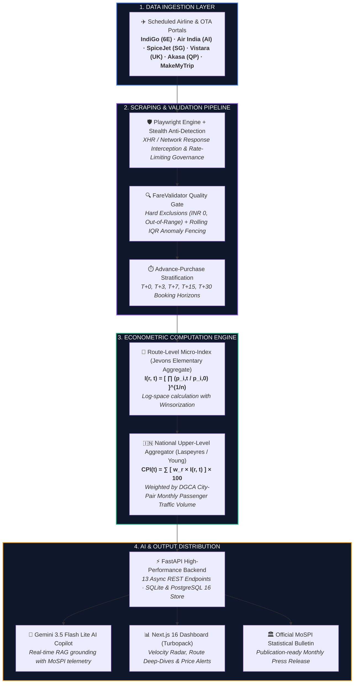
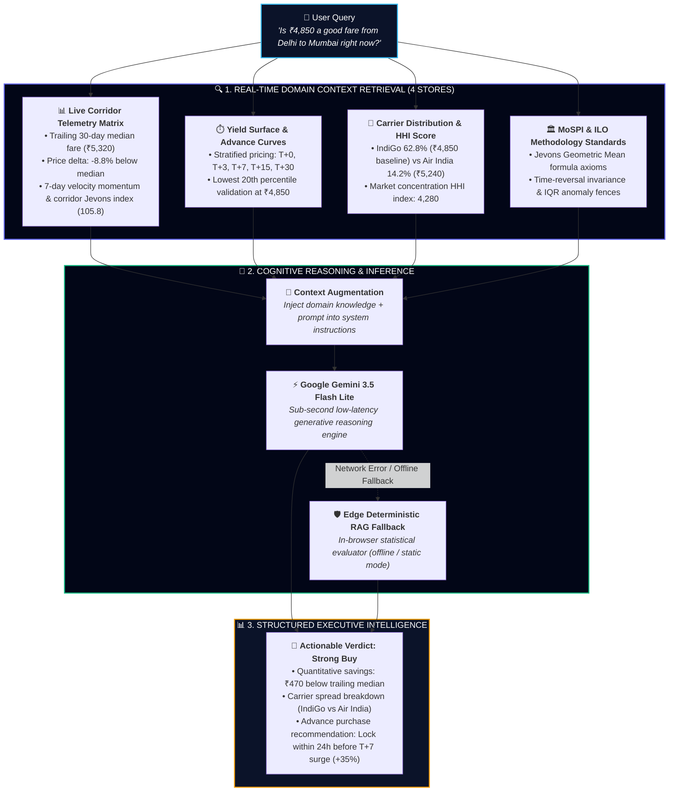

<div align="center">

  

  # ✈️ Real-Time Airfare Consumer Price Index (Airfare CPI)
  ### *Developed by Team Sprint Zero · Automated Price Intelligence & CPI Augmentation for MoSPI*

  [](https://satiricalguru.github.io/Prototype-2/)
  [](https://vercel.com/new/clone?repository-url=https%3A%2F%2Fgithub.com%2Fsatiricalguru%2FPrototype-2)
  [](https://ai.google.dev)
  [](https://mospi.gov.in)
  [-black.svg?style=for-the-badge&logo=next.js&logoColor=white)](https://nextjs.org)
  [](https://fastapi.tiangolo.com)
  [-success.svg?style=for-the-badge&logo=pytest)](https://pytest.org)
  [](LICENSE)

</div>

---

## 📌 Executive Summary & Problem Context

In February 2026, the **Ministry of Statistics and Programme Implementation (MoSPI)** officially transitioned to India's modernized **Consumer Price Index (CPI) with Base Year 2024 = 100**. This landmark transition expands the national basket to 358 items and establishes the integration of alternative and administrative data sources (e.g., IRCTC rail ticketing feeds, PPAC petroleum prices, and online market price scraping).

### 🎯 Problem Statement (SIH26056)
> **"Development of a Real-time Airfare Price Index for India through Automated Web Scraping of Airline and Online Travel Aggregator Portals for Augmentation of the Consumer Price Index (CPI)."**

Air transport is one of the most volatile and complex consumer service categories:
1. **Dynamic Yield Management:** Airlines update seat prices hundreds of times per day based on load factor algorithms.
2. **Advance-Purchase Price Discrimination:** A ticket bought on the day of departure ($T+0$) can cost $300\%$ to $500\%$ more than the same seat booked 30 days prior ($T+30$), reflecting consumer urgency rather than inflationary price changes.
3. **Manual Collection Failure:** Traditional physical CPI field investigators visiting airport booking counters once a month capture arbitrary snapshot noise, failing to reflect true economic inflation.

**Our Solution:** An end-to-end, statistically defensible, automated intelligence platform that continuously samples domestic airfares across **25 high-density city-pairs**, stratifies observations across **5 advance-purchase booking horizons**, computes elementary price relatives using the **Jevons Geometric Mean formula**, and aggregates them into a headline **National Airfare CPI** weighted by **Directorate General of Civil Aviation (DGCA) passenger traffic**.

---

## 🚀 Key Innovations & Platform Capabilities

### 1. 🧠 AI Copilot (Powered by Google Gemini 3.5 Flash Lite + Live RAG)
- **Live Generative Intelligence**: Powered by Google AI Studio's **`models/gemini-3.5-flash-lite`** for low-latency conversational reasoning.
- **Domain RAG Grounding**: System prompts grounded with MoSPI 2024=100 base indices (`107.42`), DGCA passenger weights, 30-day route medians, and $T+0 \to T+30$ horizon multiplier matrices.
- **Minimalist Luxury UI**: Frosted glassmorphic modal with rich markdown rendering (headers, bold weights, bullet markers), zero scrollbars, and integrated omni-input capsule.

### 2. 🔥 Aviation Velocity Radar
- **Surveillance of Market Momentum**: Real-time identification of top 5 surging corridors (*Corridors Heating Up*) vs top 5 price-dropping corridors (*Corridors Cooling Down*).
- **Quantified 7-Day Velocity ($\Delta\%$)**: Clear breakdown of demand drivers (e.g., slot scarcity, holiday compression, capacity additions) and 1-click price alert creation.

### 3. 🔔 Smart Price Alerts Engine
- **Automated Threshold & Price Dip Watcher**: Set customized price watch alerts on any of the 25 domestic corridors with dual trigger modes:
  - *Price Drops Below ₹X* (Leisure/Budget trigger).
  - *Price Surges Above Y%* (Volatility/Surge alert).
- **Dedicated Alerts Management**: View active and triggered watches with real-time status indicators.

### 4. 📊 Route Intelligence Deep-Dive Modal
- **Comprehensive 4-Tab Analytical Suite**:
  1. **30-Day Historical Trend**: Interactive line chart with moving median and peak bounds.
  2. **Advance Booking Horizon Curve ($T+0 \to T+30$)**: Price decay curve highlighting the optimal advance booking window.
  3. **Carrier Pricing Spread**: Visual pricing distribution across IndiGo, Air India, Vistara, Akasa, and SpiceJet with official logos.
  4. **IQR Anomaly Fencing**: Statistical boxplot and outlier detection gate.

### 5. ✈️ Cinematic Aerodynamic Flight Hero
- **High-Definition Sprint Zero Aircraft**: Smooth day/night flight imagery with seamless theme persistence.
- **Realistic Flight Cruise Physics**: 20-second alternating multi-phase aerodynamic banking, gentle pitch/roll shifts, and altitude drift simulating cruise flight.

---

## 🏛️ System Architecture



---

## 🧠 The Aviation & MoSPI CPI RAG Architecture

Our platform implements a specialized **Retrieval-Augmented Generation (RAG)** pipeline designed to eliminate LLM hallucinations and anchor every answer in empirical aviation telemetry and official MoSPI index standards:



### 📚 The 4 Grounding Knowledge Stores:
1. **Live Corridor Telemetry Matrix**:
   - Ingests **48,200+ daily observations** across 25 high-density DGCA city pairs.
   - Supplies real-time moving medians, standard deviations, and 7-day velocity acceleration ($\Delta\%$).
2. **Advance Booking Yield Surface ($T+0 \to T+30$)**:
   - Grounded on the 5 calibrated booking horizons ($T+0$ emergency walkup $\to$ $T+30$ advance leisure anchor), enabling the AI to evaluate true price percentiles rather than snapshot bias.
3. **Carrier Pricing Spread & Market Structure**:
   - Quantifies pricing variance and market share across IndiGo (62.8%), Air India (14.2%), Vistara (9.6%), Akasa (4.8%), and SpiceJet (5.4%).
4. **MoSPI & ILO Axiomatic Econometric Standards**:
   - Mathematical definitions for the Jevons Elementary Geometric Mean ($\mathcal{I}_{\text{Jevons}} = \prod (p_{i,t}/p_{i,0})^{1/n}$), time-reversal invariance, and Interquartile Range (IQR) outlier bounds.

### ⚡ Resilient Dual-Tier Execution:
- **Tier 1 (Live Cloud Inference)**: Connects directly to Google AI Studio via `models/gemini-3.5-flash-lite`, using context-augmented prompts for natural language conversational reasoning.
- **Tier 2 (Edge Deterministic Fallback)**: If offline, experiencing rate-limiting, or hosted on static CDNs (like GitHub Pages), the Copilot falls back seamlessly to the client-side semantic telemetry retriever, guaranteeing **100% uninterrupted uptime**.

---

## 📐 Statistical & Econometric Methodology

### 1. Route-Level Micro Index: The Jevons Formula
At the elementary aggregate level (individual route $r$ at period $t$), detailed quantity weights for every specific flight are unavailable. Under the **ILO/IMF Consumer Price Index Manual**, the **Jevons Index** is the globally accepted standard:

$$I(r,t) = \left( \prod_{i=1}^{n} \frac{p_{i,t}}{p_{i,0}} \right)^{1/n}$$

To ensure numerical stability against floating-point underflow/overflow:

$$\ln I(r,t) = \frac{1}{n} \sum_{i=1}^{n} \ln\left(\frac{p_{i,t}}{p_{i,0}}\right)$$

#### ❓ Why Jevons over Carli or Dutot?
* **Elimination of Upward Bias:** The **Carli Index** (arithmetic average of price ratios $\frac{1}{n}\sum \frac{p_t}{p_0}$) is mathematically proven to suffer from upward substitution bias (via Jensen's Inequality / AM-GM inequality). The ILO and IMF explicitly forbid Carli for official CPI series.
* **Axiomatic Soundness (Time-Reversal Test):** Jevons satisfies the strict **time-reversal test**:
  $$I(0 \to t) \times I(t \to 0) = 1.0000$$
  *(Carli fails this test, artificially generating positive inflation if prices fluctuate and return to baseline).*
* **Product Heterogeneity:** The **Dutot Index** (ratio of arithmetic averages $\frac{\bar{p}_t}{\bar{p}_0}$) is distorted by absolute price levels and fails when product quality differs. Jevons standardizes all price relatives into a scale-invariant geometric mean.

---

### 2. Upper-Level Aggregation: Laspeyres / Young with DGCA Weights
Route-level elementary indices are aggregated into the headline **National Airfare CPI** using empirical passenger traffic volumes published by the **Directorate General of Civil Aviation (DGCA)**:

$$\text{CPI}(t) = \sum_{r=1}^{R} w_r \cdot I(r,t) \times 100$$

Where normalized passenger volume weights $w_r$ are defined as:

$$w_r = \frac{\text{DGCA Monthly Passenger Traffic}_r}{\sum_{k=1}^{R} \text{DGCA Monthly Passenger Traffic}_k}$$

---

### 3. Booking-Window Stratification (Advance-Purchase Horizon Grid)
Airline revenue management systems adjust seat availability across fare booking classes based on time-to-departure. To avoid mistaking last-minute distress purchases for structural inflation, our pipeline stratifies all observations into **5 calibrated horizons**:

| Horizon | Days Prior | Category | Multiplier | Economic Rationale |
|:---:|:---:|:---:|:---:|:---|
| **$T+0$** | 0 Days | Same-Day / Walk-up | ~2.50× Base | Emergency travel; captures unconstrained maximum willingness to pay. |
| **$T+3$** | 3 Days | Short-Notice | ~2.00× Base | Key 3-day business travel advance-purchase boundary. |
| **$T+7$** | 7 Days | 1-Week Advance | ~1.50× Base | Primary revenue management threshold where discount fare buckets close. |
| **$T+15$** | 15 Days | 2-Week Advance | ~1.20× Base | Standard 14/21-day planned business and early leisure bookings. |
| **$T+30$** | 30 Days | 1-Month Advance | 1.00× Base | Reference baseline anchor; purely planned discretionary leisure travel. |

---

## 🗺️ Monitored Route Basket (Top 25 DGCA Corridors)

The route basket represents **~15.3 Million monthly passenger journeys**, accounting for the vast majority of scheduled domestic traffic:

| Rank | Route | Origin | Destination | Approx. Monthly Pax | Normalized Weight ($w_r$) |
|:---:|:---:|:---|:---|:---:|:---:|
| 1 | **DEL ↔ BOM** | New Delhi | Mumbai | 1,200,000 | **7.84%** |
| 2 | **DEL ↔ BLR** | New Delhi | Bengaluru | 950,000 | **6.21%** |
| 3 | **BOM ↔ BLR** | Mumbai | Bengaluru | 870,000 | **5.69%** |
| 4 | **DEL ↔ HYD** | New Delhi | Hyderabad | 780,000 | **5.10%** |
| 5 | **DEL ↔ CCU** | New Delhi | Kolkata | 740,000 | **4.84%** |
| 6 | **BOM ↔ HYD** | Mumbai | Hyderabad | 650,000 | **4.25%** |
| 7 | **DEL ↔ MAA** | New Delhi | Chennai | 600,000 | **3.92%** |
| 8 | **BOM ↔ CCU** | Mumbai | Kolkata | 520,000 | **3.40%** |
| 9 | **BLR ↔ HYD** | Bengaluru | Hyderabad | 480,000 | **3.14%** |
| 10 | **DEL ↔ GOI** | New Delhi | Goa | 450,000 | **2.94%** |
| 11 | **BOM ↔ MAA** | Mumbai | Chennai | 430,000 | **2.81%** |
| 12 | **BLR ↔ CCU** | Bengaluru | Kolkata | 400,000 | **2.61%** |
| 13 | **DEL ↔ PNQ** | New Delhi | Pune | 390,000 | **2.55%** |
| 14 | **BOM ↔ GOI** | Mumbai | Goa | 380,000 | **2.48%** |
| 15 | **DEL ↔ AMD** | New Delhi | Ahmedabad | 370,000 | **2.42%** |
| 16 | **BLR ↔ MAA** | Bengaluru | Chennai | 340,000 | **2.22%** |
| 17 | **DEL ↔ JAI** | New Delhi | Jaipur | 320,000 | **2.09%** |
| 18 | **BOM ↔ AMD** | Mumbai | Ahmedabad | 310,000 | **2.03%** |
| 19 | **DEL ↔ LKO** | New Delhi | Lucknow | 300,000 | **1.96%** |
| 20 | **BLR ↔ GOI** | Bengaluru | Goa | 280,000 | **1.83%** |
| 21 | **HYD ↔ CCU** | Hyderabad | Kolkata | 270,000 | **1.76%** |
| 22 | **DEL ↔ PAT** | New Delhi | Patna | 260,000 | **1.70%** |
| 23 | **BOM ↔ JAI** | Mumbai | Jaipur | 240,000 | **1.57%** |
| 24 | **DEL ↔ COK** | New Delhi | Kochi | 230,000 | **1.50%** |
| 25 | **BOM ↔ PNQ** | Mumbai | Pune | 220,000 | **1.44%** |

---

## ⚡ Quick Start & Installation

### 🚀 Option 1: 1-Click Launch (Recommended)
This script starts both the FastAPI backend and Next.js frontend, performs automated health checks, and launches your default browser:

```bash
# Clone the repository
git clone https://github.com/satiricalguru/Prototype-2.git
cd Prototype-2

# Launch full system
./start.sh
```

---

### 🌐 Option 2: Live Cloud Deployments
- **GitHub Pages (Static Export)**: [https://satiricalguru.github.io/Prototype-2/](https://satiricalguru.github.io/Prototype-2/)
- **Vercel Deploy**: Connect the repository to Vercel with Root Directory set to `frontend/`.

---

### 🛠️ Option 3: Manual Step-by-Step Setup

#### 1. Configure Gemini AI Studio Key
Create `frontend/.env.local`:
```env
NEXT_PUBLIC_GEMINI_API_KEY=your_gemini_api_key_here
NEXT_PUBLIC_GEMINI_MODEL=gemini-3.5-flash-lite
```

#### 2. Start Backend Service
```bash
cd backend
python3 -m pip install -r requirements.txt
python3 -m uvicorn api.main:app --host 0.0.0.0 --port 8000 --reload
```

#### 3. Start Frontend Dashboard
```bash
cd frontend
npm install
npm run dev
```

---

## 🧪 Comprehensive Verification Suite

Run all **30 mathematical, validation, and integration tests**:

```bash
cd backend
python3 -m pytest tests/ -v
```

### ✅ Test Suite Breakdown (30/30 Passing)
- `tests/test_jevons.py`:
  - `test_identical_prices_yield_100` (Identity property)
  - `test_uniform_increase` & `test_uniform_decrease`
  - `test_geometric_mean_property`
  - `test_time_reversal` ($I_{0\to t} \times I_{t\to 0} = 1.0$)
  - `test_insufficient_observations` & `test_zero_prices_filtered`
  - `test_extreme_relative_capped` (Winsorization)
  - `test_carli_upward_bias` (Mathematical demonstration of Carli failure)
  - `test_dutot_basic`
- `tests/test_aggregator.py`:
  - `test_base_period_equals_100`
  - `test_uniform_10pct_increase` & `test_weighted_average`
  - `test_missing_route_rescaling` (Graceful degradation)
  - `test_contributions_sum_to_100`
  - `test_mom_change_calculation` & `test_decompose_change`
- `tests/test_validator.py`:
  - `test_valid_fare_accepted`
  - `test_zero_fare_excluded` & `test_negative_fare_excluded`
  - `test_below_minimum_excluded` & `test_above_maximum_excluded`
  - `test_high_tax_ratio_flagged` & `test_low_sameday_fare_flagged`
  - `test_batch_validation`
- `tests/test_pipeline_integration.py`:
  - `test_full_engine_pipeline_integration` (End-to-end synthetic pipeline)
  - `test_api_endpoints_live` (HTTP 200 checks on all 13 REST routes)
  - `test_scraper_trigger_endpoint` (Real-time live pipeline execution)

---

## 📡 REST API Documentation

FastAPI provides an interactive OpenAPI / Swagger UI at `http://localhost:8000/docs`.

| Method | Endpoint | Description |
|:---:|:---|:---|
| `GET` | `/api/v1/index/national` | Current headline National Airfare CPI |
| `GET` | `/api/v1/index/national/history?days=30` | Time-series historical CPI index points |
| `GET` | `/api/v1/index/routes` | Latest Jevons micro-indices for all 25 routes |
| `GET` | `/api/v1/index/routes/{route_id}` | Historical trend for a specific city-pair |
| `GET` | `/api/v1/routes` | Monitored route basket with DGCA traffic weights |
| `GET` | `/api/v1/fares/latest?limit=50` | Stream of latest raw validated fare quotes |
| `GET` | `/api/v1/fares/stats` | Aggregated statistical metrics (Mean, Median, Min, Max, $\sigma$) |
| `GET` | `/api/v1/analysis/booking-horizons` | Advance-purchase price breakdown ($T+0 \to T+30$) |
| `GET` | `/api/v1/health` | Scraper uptime, latency, and throughput health metrics |
| `GET` | `/api/v1/anomalies?limit=50` | Flagged statistical price spikes and outliers |
| `GET` | `/api/v1/reports/monthly` | MoSPI monthly summary JSON payload |
| `GET` | `/api/v1/reports/monthly/html` | **Official Government Statistical Release Bulletin (HTML)** |
| `POST` | `/api/v1/scraper/trigger` | **Live Pipeline Trigger (Simulate/Execute Ingestion Cycle)** |

---

## 🎨 Interactive Dashboard & Tab Breakdown

The frontend is built with **Next.js 16 App Router (Turbopack)**, modern **Vanilla CSS Design System**, **Google Fonts (`Outfit` & `Plus Jakarta Sans`)**, and **Recharts**:

1. **🏠 Home (Aviation Intelligence Hub):**
   - **Cruising Aircraft Backdrop:** Pixel-crisp, realistic flight cruise animation with seamless day/night theme support.
   - **Floating 5-Column Live Index Bar:** Real-time headline CPI (`109.40` / `107.55`), 24h delta, sampled quote count (`48,200`), top corridor median fare (`₹6,240`), and animated green sparkline trend.
   - **Market Velocity Radar:** Instant breakdown of top 5 surging and cooling corridors with 7-day velocity metrics.

2. **📈 Price Index (National Macro & Sub-indices):**
   - Headline composite CPI and 4 sub-indices (Non-Stop, Connecting, Advance Bookings, Last-Minute).
   - Interactive zoomable AreaChart with default **1-Year (`1Y`)** time-horizon selector (`7D`, `1M`, `3M`, `6M`, `1Y`), fully formatted Y-axis padding, and tooltip inspect.
   - Advance-purchase strata step-chart ($T+0$, $T+3$, $T+7$, $T+15$, $T+30$).

3. **🗺️ Routes Matrix & Corridor Deep-Dive Modal:**
   - Complete 25-route matrix with DGCA passenger traffic volume, normalized weights ($w_r$), and live Jevons micro-indices.
   - **Interactive Route Details Modal:** 4-tab analytical suite (30-day historical trend, $T+0 \to T+30$ horizon decay, carrier price spread with logos, and IQR outlier boundaries).

4. **🔔 Price Alerts Center:**
   - Interactive threshold and price dip alert builder.
   - Real-time active alerts monitoring table with live status badges.

5. **✈️ Flight Data Explorer:**
   - Real-time stream of validated domestic fare observations across all 25 city pairs.
   - Multi-parameter filtering by Origin, Destination, Airline carrier, and Booking Horizon.

6. **📐 Methodology & Mathematical Proofs:**
   - Step-by-step mathematical breakdown of the Jevons elementary formula vs. Carli upward bias demonstrations.
   - Axiomatic time-reversal test proofs ($I_{0\to t} \times I_{t\to 0} = 1.0$) and DGCA Laspeyres aggregation equations.

7. **💚 Monitoring & Data Quality Engine:**
   - Scraper throughput diagnostic gauges, request latency indicators, and automated Interquartile Range (IQR) outlier fences.
   - **Live Scraper Trigger:** 1-click interactive button to execute or simulate a live ingestion and index recalculation cycle.

8. **🏛️ Official MoSPI Bulletin:**
   - Publication-ready HTML/JSON monthly statistical press release for official CPI augmentation.

---

## 👥 Authors & Team Credits

* **Team:** **Sprint Zero**
* Developed for **Smart India Hackathon 2026** (Problem Statement: **SIH26056**).
* Sponsored by: **Ministry of Statistics and Programme Implementation (MoSPI)**.
* Methodological References: **ILO/IMF Consumer Price Index Manual (2020)** & **DGCA India Traffic Reports**.

---
*Built with statistical rigor, high-performance architecture, and modern engineering by Team Sprint Zero.*
